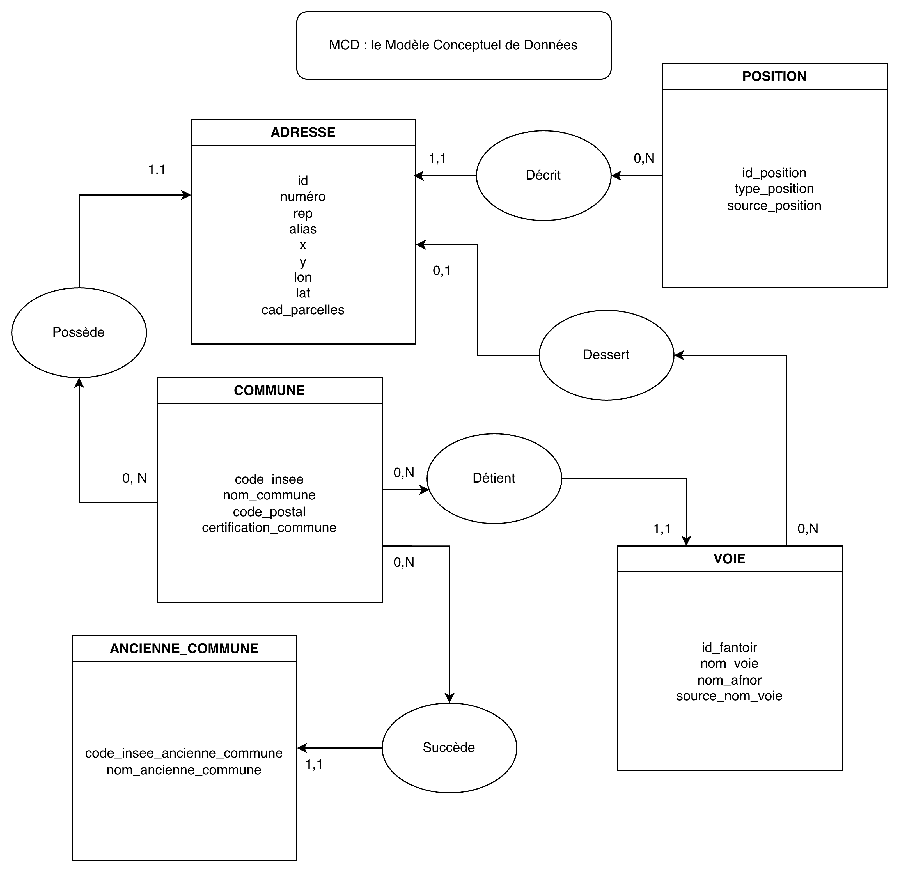
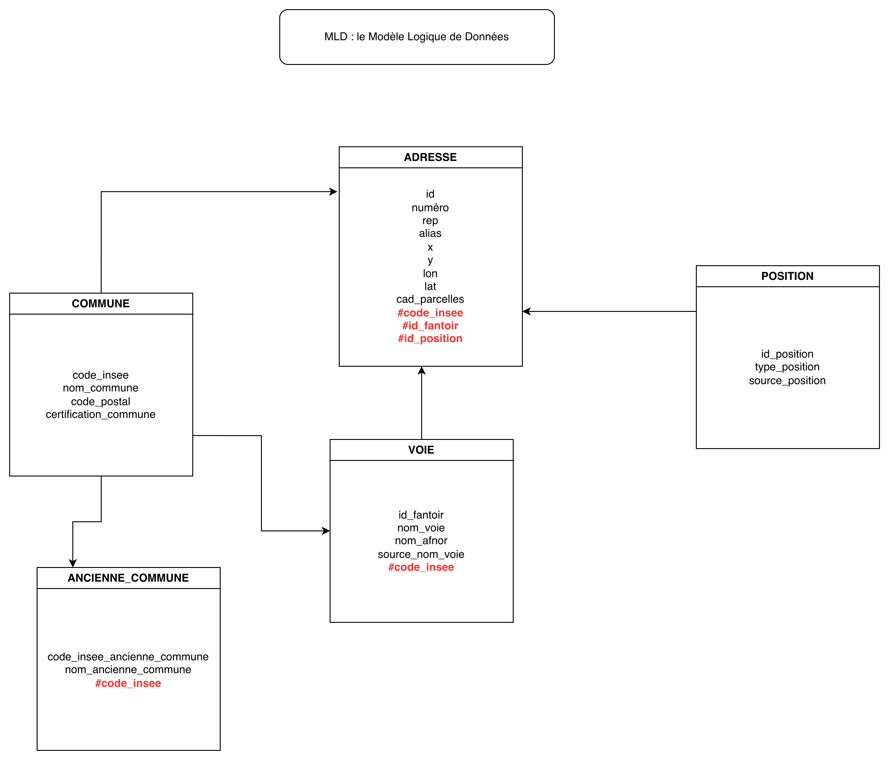
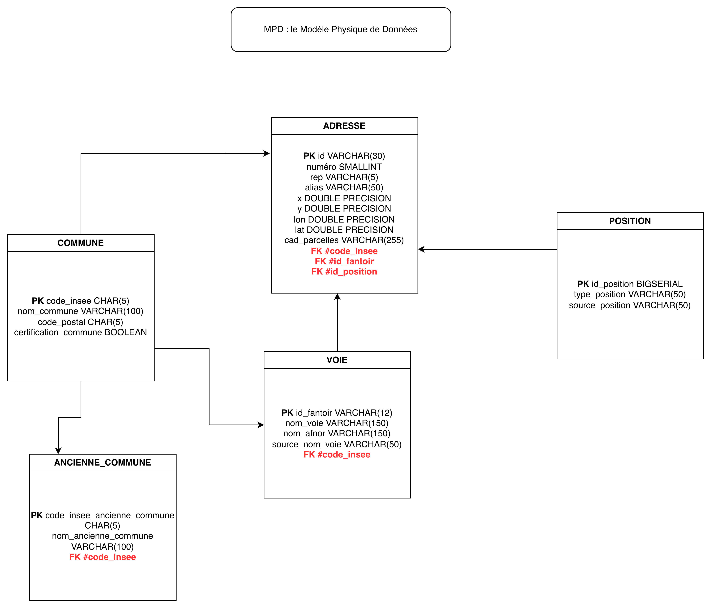

# 🏗️ 2. Modélisation MERISE

## Construire le MCD (identification des entités et relations)

_Note : Lors de l’analyse finale du MCD, il est apparu que la relation directe Commune → Adresse pouvait être déduite indirectement via les voies, ce qui introduit une redondance dans le modèle. Un modèle normalisé pourrait supprimer cette relation.
Ce choix n’a pas été effectué au départ pour une raison liée au contexte du projet : certaines adresses n’ont pas de voie (lieux-dits, écarts, adresses atypiques).
Une version V2 pourrait adopter une normalisation plus stricte qui nécessiterait une réécriture du MPD, des scripts SQL, du processus de transformation, des triggers, etc..._

---

## Formaliser les règles de gestion et le dictionnaire de données

### 📕 Règles de gestion

**RG1.** Chaque **commune** est identifiée par un **code INSEE** unique.

**RG2.** Chaque **voie** appartient à une seule **commune**.

**RG3.** Chaque **adresse** appartient à une seule **commune**.

**RG4.** Une **voie** peut desservir plusieurs **adresses**, mais une **adresse** n'a qu'une seule voie.

**RG5.** Chaque **adresse** possède une **position** géographique unique.

**RG6.** Une **position** peut être commune à plusieurs adresses.

**RG7.** Chaque **ancienne commune** est rattachée à une **commune actuelle**.

**RG8.** L’identifiant d’adresse (`id`) est unique et stable dans le temps.

**RG9.** Tous les codes (INSEE, postal, FANTOIR) sont considérés comme **chaînes de caractères** (pas de conversion numérique).

**RG10.** Les coordonnées `lon` et `lat` sont exprimées en **WGS84** (double précision).

**RG11.** Les coordonnées `x` et `y` sont exprimées dans le système projeté source (Lambert 93).

**RG12.** Le champ `cad_parcelles` contient une **liste de références cadastrales** séparées par `|`.

**RG13.** Une adresse peut ne pas avoir de voie (par ex. lieu-dit isolé).

**RG14.** Le champ `certification_commune` indique si la commune a validé l’adresse (`TRUE/FALSE`).

**RG15.** Lors de l’import, si une combinaison `(type_position, source_position)` n’existe pas, elle est automatiquement ajoutée à la table `POSITION`.

---

### 📗 Dictionnaire de données

#### Table : COMMUNE

| Code                  | Libellé                                       | Type    | Taille | E/C | Règle de calcul | Règles / Contraintes  |
| --------------------- | --------------------------------------------- | ------- | ------ | --- | --------------- | --------------------- |
| code_insee            | Code INSEE de la commune                      | CHAR    | 5      | E   | –               | Format `00000`        |
| nom_commune           | Nom officiel de la commune                    | VARCHAR | 100    | E   | –               | –                     |
| code_postal           | Code postal                                   | CHAR    | 5      | E   | –               | Format `00000`        |
| certification_commune | Indique si la commune a certifié ses adresses | BOOLEAN | –      | E   | –               | Valeurs {TRUE, FALSE} |

#### Table : VOIE

| Code            | Libellé                      | Type    | Taille | E/C | Règle de calcul | Règles / Contraintes      |
| --------------- | ---------------------------- | ------- | ------ | --- | --------------- | ------------------------- |
| id_fantoir      | Identifiant FANTOIR          | VARCHAR | 12     | E   | –               | Unique au niveau national |
| nom_voie        | Nom complet de la voie       | VARCHAR | 150    | E   | –               | –                         |
| nom_afnor       | Nom au format AFNOR          | VARCHAR | 150    | E   | –               | –                         |
| source_nom_voie | Source du libellé de la voie | VARCHAR | 50     | E   | –               | –                         |

#### Table : POSITION

| Code            | Libellé                                          | Type      | Taille | E/C | Règle de calcul | Règles / Contraintes                             |
| --------------- | ------------------------------------------------ | --------- | ------ | --- | --------------- | ------------------------------------------------ |
| id_position     | Identifiant technique de la position             | BIGSERIAL | –      | C   | Auto-incrément  | –                                                |
| type_position   | Type de position (entrée, bâtiment, etc.)        | VARCHAR   | 50     | E   | –               | –                                                |
| source_position | Origine de la position (BAN, commune, IGN, etc.) | VARCHAR   | 50     | E   | –               | Couple `(type_position, source_position)` unique |

#### Table : ANCIENNE_COMMUNE

| Code                        | Libellé                      | Type    | Taille | E/C | Règle de calcul | Règles / Contraintes |
| --------------------------- | ---------------------------- | ------- | ------ | --- | --------------- | -------------------- |
| code_insee_ancienne_commune | Ancien code INSEE            | CHAR    | 5      | E   | –               | Format `00000`       |
| nom_ancienne_commune        | Nom historique de la commune | VARCHAR | 100    | E   | –               | –                    |

#### Table : ADRESSE

| Code          | Libellé                                      | Type             | Taille | E/C | Règle de calcul | Règles / Contraintes                        |
| ------------- | -------------------------------------------- | ---------------- | ------ | :-: | --------------- | ------------------------------------------- |
| id            | Identifiant unique de l’adresse              | VARCHAR          | 30     |  E  | –               | Valeur unique                               |
| numero        | Numéro dans la voie                          | SMALLINT         | –      |  E  | –               | ≥ 0                                         |
| rep           | Indice de répétition (bis, ter, etc.)        | VARCHAR          | 5      |  E  | –               | –                                           |
| alias         | Alias de l’adresse (ex. lieu-dit, autre nom) | VARCHAR          | 50     |  E  | –               | –                                           |
| x             | Coordonnée X (système projeté)               | DOUBLE PRECISION | –      |  E  | –               | Lambert-93 (EPSG:2154), unité : mètre       |
| y             | Coordonnée Y (système projeté)               | DOUBLE PRECISION | –      |  E  | –               | Lambert-93 (EPSG:2154), unité : mètre       |
| lon           | Longitude géographique                       | DOUBLE PRECISION | –      |  E  | –               | WGS84 (EPSG:4326), valeur entre -180 et 180 |
| lat           | Latitude géographique                        | DOUBLE PRECISION | –      |  E  | –               | WGS84 (EPSG:4326), valeur entre -90 et 90   |
| cad_parcelles | Références cadastrales liées                 | VARCHAR          | 255    |  E  | –               | Valeur libre (séparateur)                   |

---

## Préciser les contraintes (unicité, cardinalités, dépendances fonctionnelles)

| Association                    | Lien                                                       | Cardinalités. |
| ------------------------------ | ---------------------------------------------------------- | ------------- |
| **Commune – Adresse**          | Une commune possède plusieurs adresses                     | (1,n)         |
| **Voie – Adresse**             | Une voie contient plusieurs adresses                       | (1,n)         |
| **Adresse – Parcelle**         | Une adresse peut concerner plusieurs parcelles cadastrales | (0,n)         |
| **Commune – Ancienne commune** | Une ancienne commune est devenue une commune actuelle      | (0,1)         |

---

## Décliner ensuite le MLD et le MPD

## MLD

## MPD

