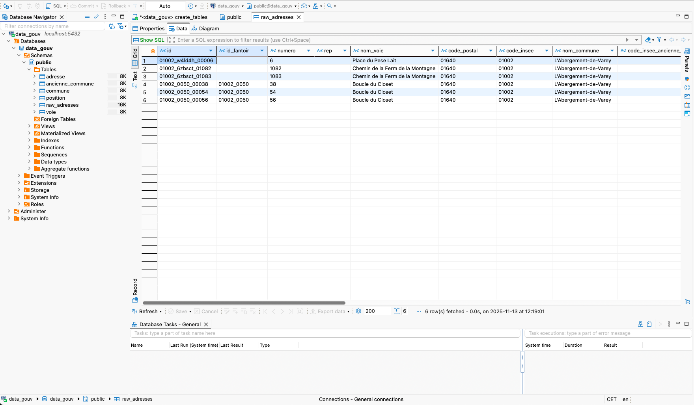

# 📘 3. Mise en place de la base

## Création des tables issues du MPD

Pour cette étape on execute ce script dans DBeaver sur la bdd créée préalablement :

```
create_tables.sql
```

Ce script :

- crée la table brute `raw_adresses` utile pour l'import brut des données du CSV
- crée les tables :
  - `commune`
  - `voie`
  - `position`
  - `ancienne_commune`
  - `adresse`

Ce script ajoute également les contraintes d’intégrité des clés étrangères pour:

- Correspondre exactement au MPD
- Apporter de la cohérence dans les données

---

## Insérer un jeu d’échantillon issu du CSV pour les tests

Dans DBeaver j'effectue :

1. Je selectionne `../data/raw_test.csv`
2. Clic droit → **Import Data**
3. J'importe le CSV de test
4. Je définis `;` comme séparateur
5. Je valide

J'obtiens les données non traitées dans la table raw :



Si l’on n’utilise pas DBeaver, il est également possible d’importer manuellement les données en exécutant le script `./sql/import_raw_test.sql` dans un terminal psql (connecté à la bdd). Cette version nécessite que le fichier soit accessible en indiquant son chemin absolu.

---

## Transformation SQL → modèle normalisé

Pour cette partie le script qui nous interesse est celui-ci :

```
transform.sql
```

Ce script :

- extrait les données distinctes de `raw_adresses`
- remplit les tables normalisées :

  - `commune`
  - `voie`
  - `position`
  - `ancienne_commune`
  - `adresse`

- nettoie et normalise les données (TRIM, tronquage aux longueurs du MPD, conversions typées, gestion des valeurs vides via NULLIF)
- reconstruit les relations (id_position via LEFT JOIN, remplissage automatique des clés étrangères)
- assure l’idempotence du chargement grâce à ON CONFLICT DO NOTHING (sur commune, voie, ancienne_commune, adresse) et à la détection manuelle des doublons pour position.

Grâce à cela, le script peut être rejoué après chaque nouvel import CSV.

---

## Vérification de la cohérence et de la normalisation

Une fois la transformation effectuée, on peut effectuer quelques contrôles pour valider la qualité du modèle et la bonne cohérence des données insérées dans les tables normalisées.

Les requêtes disponible dans le fichier, constituent un jeu de tests minimal et suffisant :

```
tests.sql
```

Les requètes de ce fichier permettent par exemple de vérifier :

- que les tables normalisées ont bien été remplies
- l’unicité des identifiants d’adresse
- que toutes les adresses sont rattachées à une commune
